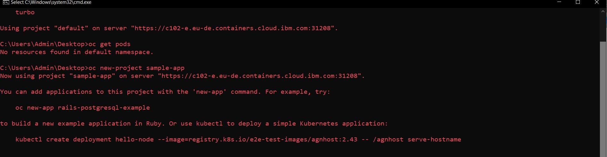
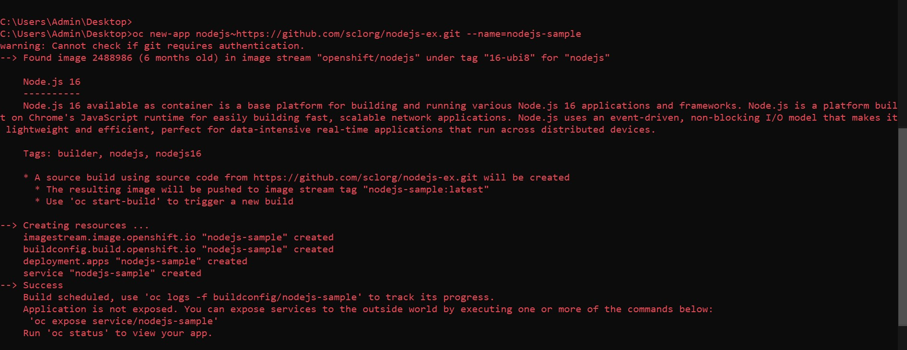
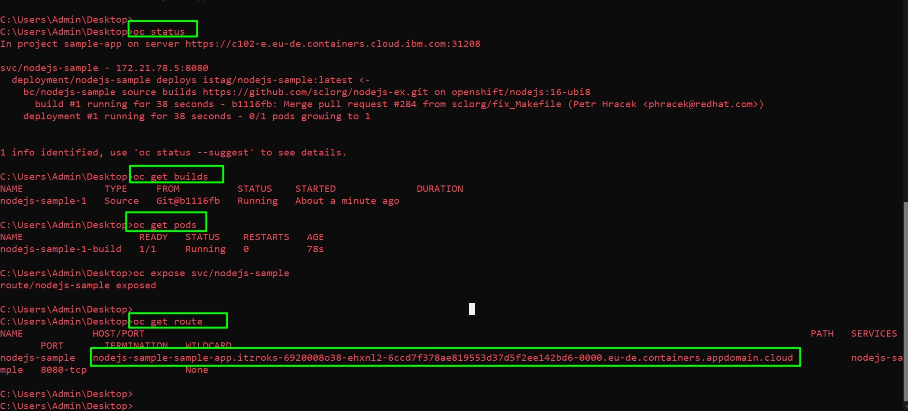
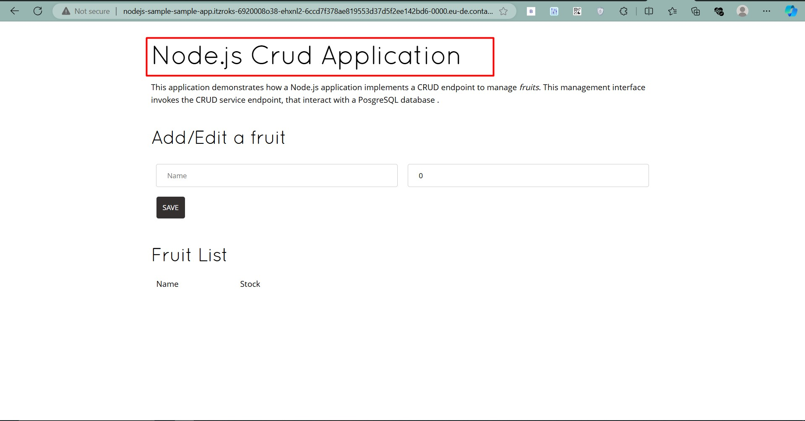

# Deploying a Sample CRUD App on OpenShift


# Introduction

In this tutorial, we will demonstrate how to deploy a **sample CRUD application** on the **OpenShift Container Platform** using the `oc` CLI and the OpenShift web console. By the end of this guide, you will have a fully functional Node.js-based CRUD application running in your OpenShift cluster, accessible through a web browser.

---

## 🛠️ Step-by-Step Guide to Deploy a Sample CRUD App on OpenShift

Follow the steps below to deploy and access the application in your browser.

### Step 1: Log in to OpenShift Cluster

- Access the OpenShift console URL from your cluster.
- Use the `oc login` command to authenticate:

```bash
oc login https://api.<cluster_name>.<base_domain>:6443 --token=<your_token>
```

Alternatively, use the **OpenShift Web Console** to log in using your credentials.

### Step 2: Create a New Project

You need to create a new project (namespace) to host your application. Run the command below:

```bash
oc new-project crud-app
```


Or, create the project in the web console:

1. Go to **Projects**.
2. Click **Create Project** and provide a name (e.g., `crud-app`).
3. Click **Create**.

### Step 3: Deploy a Sample Application

Deploy a sample Node.js CRUD app from a public GitHub repository:

```bash
oc new-app nodejs~https://github.com/sclorg/nodejs-ex.git --name=crud-sample
```

This command will:
- Create a new app (`new-app`) using the `nodejs` builder image.
- Clone the source code from the provided GitHub repository.
- Name the application `crud-sample`.



### Step 4: Monitor the Build and Deployment

Check the build and deployment status using the following commands:

```bash
oc get builds
oc get pods
```

You can also view the build and deployment logs in the **Web Console** under **Builds** and **Pods**.

### Step 5: Expose the Application to the Internet

To access the application, you need to create a **Route** that exposes the service externally:

```bash
oc expose svc/crud-sample
```

This command will expose the `crud-sample` service with a default route like `http://crud-sample-crud-app.<base_domain>`.

Or, in the **Web Console**:
1. Go to **Networking** > **Routes**.
2. Click **Create Route**.
3. Select the service (e.g., `crud-sample`) and create the route.

### Step 6: Access the Application in Browser

Once the route is created, run the following command to get the application URL:

```bash
oc get route
```


Use the URL displayed in the output to open the application in your browser. The URL will look like `http://crud-sample-crud-app.<base_domain>`.



### Step 7: Test the CRUD Functionality

Open the application URL in your browser and test the basic CRUD operations like:

- **Create** a new record.
- **Read** the records.
- **Update** an existing record.
- **Delete** a record.

This confirms that your sample CRUD application is successfully running on OpenShift.

---

## 🌐 Additional Resources

For more details on working with OpenShift, check out the [OpenShift Documentation](https://docs.openshift.com/) and other blog posts on my [website](https://abdulrahmanh.com).

---

## 🔒 License

This repo is licensed under the MIT License.

